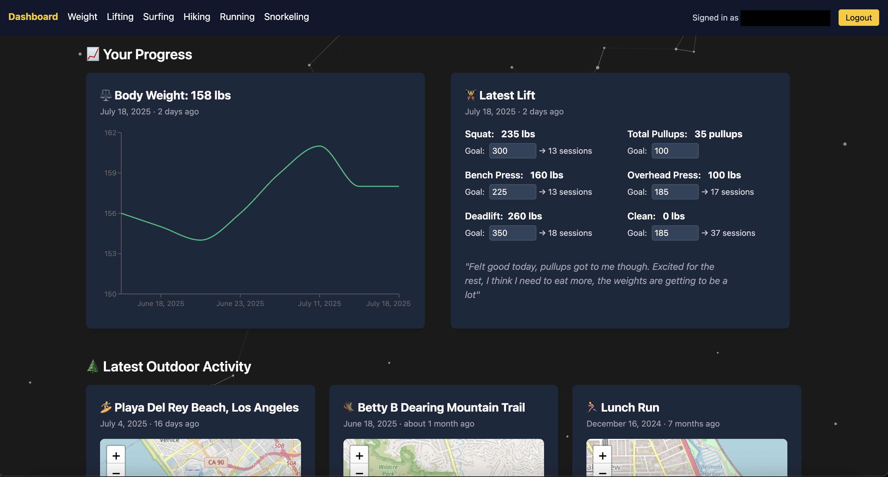
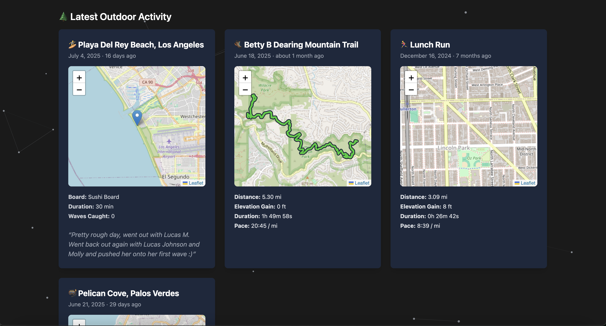
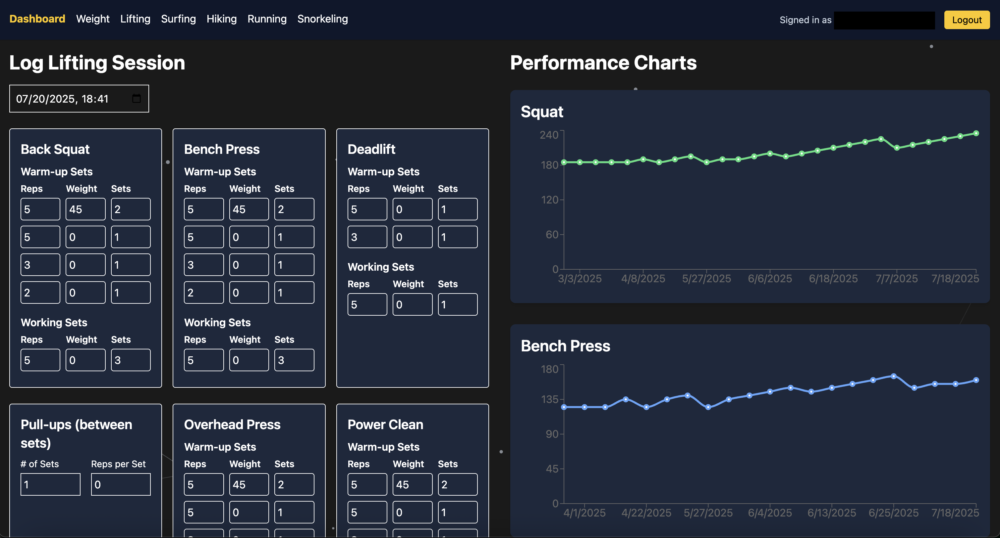
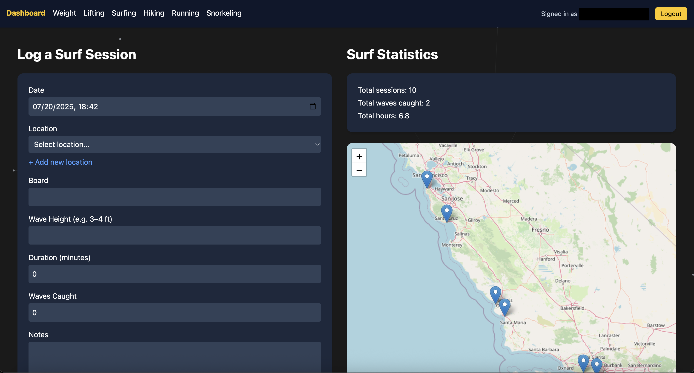
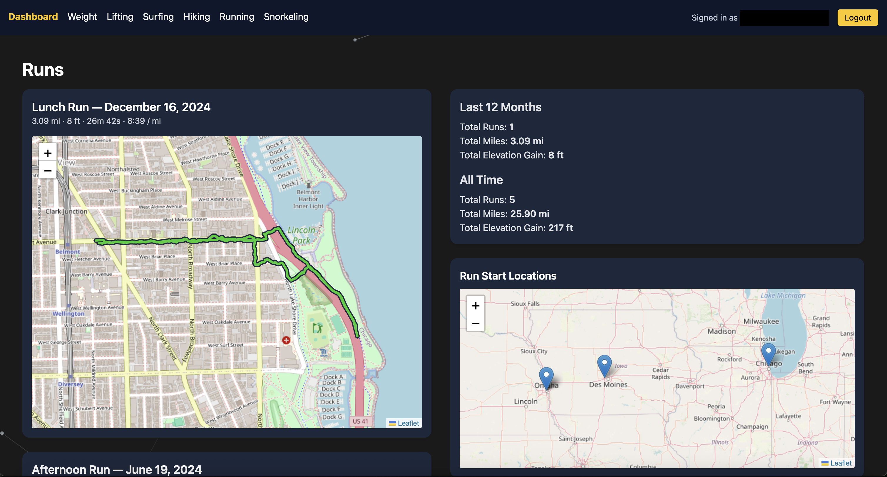
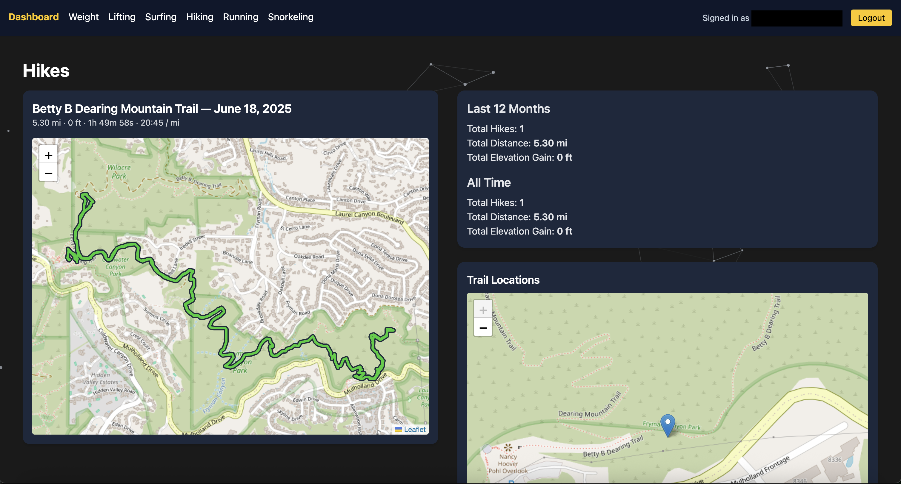

# Fitness Logger 🏋️‍♂️

A lightweight and responsive fitness logging app that tracks my weight and lifting progress, as well as my outdoor activity sessions (surfing, hiking, running, and snorkeling). Built with **React**, **Supabase**, and **Tailwind CSS**, it features session history, statistics, and location-based visualization via interactive maps.

It also integrates with the **Strava API** to automatically sync and display activities logged on Strava, making it easy to combine manual and Strava logged data in one place.

## Features

- 🔐 Authentication via Supabase
- 📓 Logs for six different activities: weight tracking, weightlifting, surfing, hiking, running, and snorkeling
- 📍 View outdoor activities on a map with React-Leaflet + OpenStreetMap
- 📈 Analyze activity trends with historical statistics
- ⚡  Fast, mobile-friendly UI with React + Tailwind

## Tech Stack

- **Frontend**: React + Vite + Tailwind CSS
- **Backend**: Supabase (PostgreSQL, Auth, Edge Functions)
- **Map**: React-Leaflet + OpenStreetMap
- **Third-Party Integration**: Strava API
- **Deployment**: Vercel

## Getting Started

### 1. Clone the repo

```bash
git clone https://github.com/colinrec34/fitness-logger.git
cd fitness-logger
```

### 2. Install npm dependencies
```bash
npm install
```

### 3. Define environment variables
```
VITE_SUPABASE_URL=your-supabase-url
VITE_SUPABASE_ANON_KEY=your-anon-key
```

### 4. Start Local Dev Server
```bash
npm run dev
```

## Project Structure
```
src/
├── api/              # Supabase client + API utilities
├── components/       # Reusable UI elements
├── lib/              # Supabase api tools
├── pages/            # Activity pages (lifting, surf, etc.) and Home/Login pages
├── App.tsx           # App entry point
└── main.tsx          # Vite entry file
```

## 🔮 Planned Updates
- Activity editing and deletion
- Profile dashboard for managing activities (including Strava-connected types);
- Generalize activities for easy management and no hardcoded pages

## 📌 Notes
This was designed based on my personal logging ambitions, but can be easily extended to other activities and layouts. Generic templates are included in the pages/activities directory for quick addition of new activities. In the future, these templates will generate all the activities themselves, so no pages are hardcoded with custom ```.tsx``` files.

## 📸 Screenshots

<p align="center">
  
  
</p>
<p align="center">
  
  
</p>
<p align="center">
  
  
</p>


## 📄 License
MIT © Colin Recker
